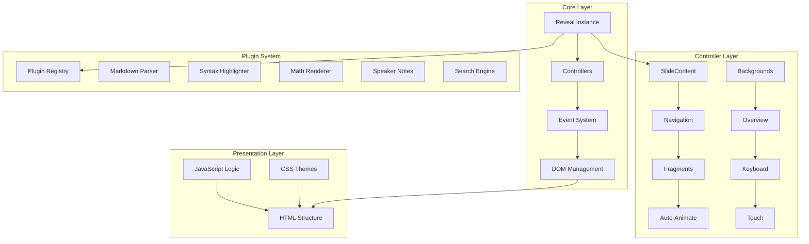
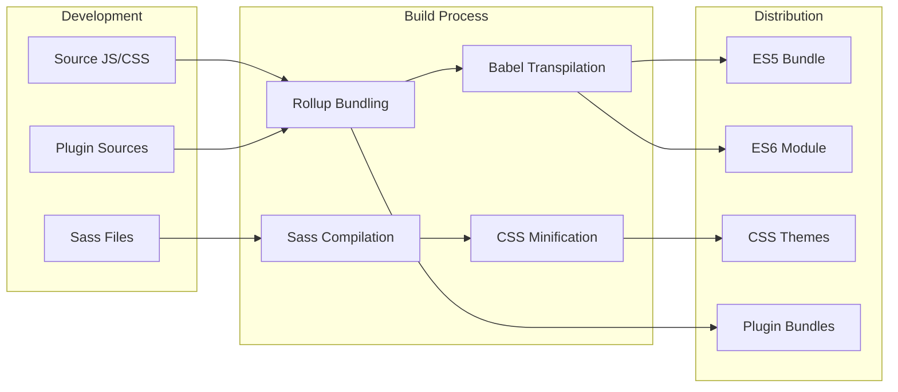
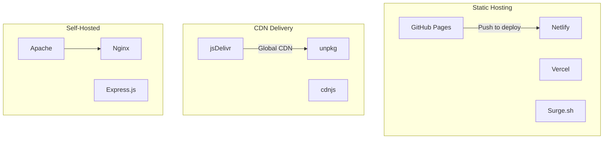

<div align="center"><a name="readme-top"></a>

[](#)

# 🎨 reveal.js<br/><h3>The HTML Presentation Framework</h3>

An innovative HTML presentation framework that leverages cutting-edge web technologies to create beautiful presentations.<br/>
Supports Markdown content, syntax highlighting, themes, and extensible plugin architecture with Auto-Animate transitions.<br/>
One-click **FREE** deployment of your stunning presentations.

[Official Site][official-site] · [Documentation][docs] · [Demo][demo-link] · [Issues][github-issues-link]

<br/>

[][project-link]

<br/>

<!-- SHIELD GROUP -->

[![][github-release-shield]][github-release-link]
[![][npm-release-shield]][npm-release-link]
[![][jsdelivr-shield]][jsdelivr-link]
[![][discord-shield]][discord-link]<br/>
[![][github-action-test-shield]][github-action-test-link]
[![][github-action-release-shield]][github-action-release-link]
[![][github-releasedate-shield]][github-releasedate-link]<br/>
[![][github-contributors-shield]][github-contributors-link]
[![][github-forks-shield]][github-forks-link]
[![][github-stars-shield]][github-stars-link]
[![][github-issues-shield]][github-issues-link]
[![][github-license-shield]][github-license-link]<br>
[![][sponsor-shield]][sponsor-link]

**Share reveal.js**

[![][share-x-shield]][share-x-link]
[![][share-telegram-shield]][share-telegram-link]
[![][share-whatsapp-shield]][share-whatsapp-link]
[![][share-reddit-shield]][share-reddit-link]
[![][share-linkedin-shield]][share-linkedin-link]

<sup>🌟 Pioneering the future of web presentations. Built for developers, designers, and content creators worldwide.</sup>

[![][github-trending-shield]][github-trending-url]

## 📸 Project Screenshots

> [!TIP]
> Experience reveal.js in action with these stunning presentation examples.

<div align="center">
  
  <p><em>Main Presentation Interface - Clean, modern design</em></p>
</div>

<div align="center">
  
  
  <p><em>Speaker Notes View and Beautiful Themes</em></p>
</div>

<details>
<summary><kbd>📱 More Screenshots</kbd></summary>

<div align="center">
  
  <p><em>Mobile & Touch Optimized</em></p>
</div>

<div align="center">
  
  <p><em>Slide Overview & Navigation</em></p>
</div>

</details>

## 🎬 Demo Video

> [!NOTE]
> Watch reveal.js in action - creating beautiful presentations with web technologies.

<div align="center">

[](https://www.youtube.com/watch?v=xnE_448pQZ8)

*Click the image above to watch the reveal.js showcase*

</div>

**Tech Stack Badges:**

<div align="center">

 
 
 
 
 
 
 

</div>

</div>

> [!IMPORTANT]
> reveal.js is the most popular HTML presentation framework with 67k+ GitHub stars. It combines modern web technologies with powerful features like Markdown support, syntax highlighting, Auto-Animate transitions, and an extensive plugin ecosystem. Perfect for developers, educators, and anyone who wants beautiful, interactive presentations.

<details>
<summary><kbd>📑 Table of Contents</kbd></summary>

#### TOC

- [🎨 reveal.js](#-revealjs)
      - [TOC](#toc)
  - [🌟 Introduction](#-introduction)
  - [✨ Key Features](#-key-features)
    - [`1` Core Presentation Engine](#1-core-presentation-engine)
    - [`2` Advanced Animations & Transitions](#2-advanced-animations--transitions)
    - [`*` Additional Features](#-additional-features)
  - [🛠️ Tech Stack](#️-tech-stack)
  - [🏗️ Architecture](#️-architecture)
  - [⚡️ Performance](#️-performance)
  - [🚀 Getting Started](#-getting-started)
  - [🛳 Deployment](#-deployment)
  - [📖 Usage Guide](#-usage-guide)
  - [🔌 Integrations](#-integrations)
  - [📦 Ecosystem](#-ecosystem)
  - [⌨️ Development](#️-development)
  - [🤝 Contributing](#-contributing)
  - [❤️ Sponsor](#️-sponsor)
  - [📄 License](#-license)
  - [👥 Team](#-team)

####

<br/>

</details>

## 🌟 Introduction

We are passionate developers creating next-generation web presentation solutions. By adopting modern web standards and cutting-edge technologies, we provide users and developers with powerful, scalable, and beautiful presentation tools.

Whether you're a developer, educator, designer, or content creator, reveal.js will be your ultimate presentation platform. Built with performance and extensibility in mind, it supports everything from simple slide decks to complex interactive presentations.

> [!NOTE]
> - Node.js >= 18.0 required for development
> - Modern browser with ES6 support
> - No server required for basic presentations
> - Optional plugins enhance functionality

| [![][demo-shield-badge]][demo-link]   | No installation required! Visit our demo to experience it firsthand.                           |
| :------------------------------------ | :--------------------------------------------------------------------------------------------- |
| [![][discord-shield-badge]][discord-link] | Join our community! Connect with developers and presentation enthusiasts. |

> [!TIP]
> **⭐ Star us** to receive all release notifications from GitHub without delay!

[![][image-star]][github-stars-link]

<details>
  <summary><kbd>⭐ Star History</kbd></summary>
  <picture>
    <source media="(prefers-color-scheme: dark)" srcset="https://api.star-history.com/svg?repos=hakimel%2Freveal.js&theme=dark&type=Date">
    
  </picture>
</details>

## ✨ Key Features

[![][image-feat-core]][docs-feat-core]

### `1` [Core Presentation Engine][docs-feat-core]

Experience next-generation HTML presentations with reveal.js. Our innovative framework provides unprecedented flexibility through advanced web technologies. Create stunning, interactive presentations that work seamlessly across all devices.

<div align="center">
  
  <p><em>Write slides in Markdown - Simple and powerful</em></p>
</div>

Key capabilities include:
- 🚀 **Blazing Fast**: Hardware-accelerated CSS transitions
- 🔧 **Zero Dependencies**: Works out of the box
- 📱 **Responsive Design**: Perfect on all screen sizes
- 🛡️ **Framework Agnostic**: Use with any backend

> [!TIP]
> You can create presentations using pure HTML or write content in Markdown for faster authoring.

[![][back-to-top]](#readme-top)

### `2` [Advanced Animations & Transitions][docs-feat-advanced]

Revolutionary Auto-Animate feature that transforms how content transitions between slides. With our advanced animation engine, elements smoothly morph, move, and transform while maintaining perfect timing and easing.

<div align="center">
  
  
  <p><em>Auto-Animate Transitions (left) and Beautiful Themes (right)</em></p>
</div>

**Available Features:**
- **Auto-Animate**: Seamless element morphing between slides
- **Fragments**: Progressive content revelation
- **Backgrounds**: Video, image, and gradient backgrounds
- **3D Transforms**: CSS3-powered slide transitions

[![][back-to-top]](#readme-top)

### `*` Additional Features

Beyond the core presentation engine, reveal.js includes:

- [x] 💨 **Quick Setup**: Create presentations in minutes
- [x] 🌐 **Multi-format**: HTML, Markdown, and mixed content
- [x] 🔒 **Offline Ready**: No internet connection required
- [x] 💎 **Professional Themes**: 10+ built-in themes
- [x] 🗣️ **Speaker Notes**: Private notes and timing
- [x] 📊 **Math Support**: LaTeX equations with MathJax/KaTeX
- [x] 🔌 **Plugin System**: Extensible architecture
- [x] 📱 **Touch Gestures**: Mobile-friendly navigation
- [x] 🎨 **Syntax Highlighting**: Beautiful code presentation
- [x] 📄 **PDF Export**: High-quality print output
- [x] 🔍 **Search**: Find content across slides
- [x] 🎯 **Jump to Slide**: Quick navigation

> ✨ More features are continuously being added as the project evolves.

<div align="right">

[![][back-to-top]](#readme-top)

</div>

## 🛠️ Tech Stack

<div align="center">
  <table>
    <tr>
      <td align="center" width="96">
        
        <br>JavaScript ES6+
      </td>
      <td align="center" width="96">
        
        <br>HTML5
      </td>
      <td align="center" width="96">
        
        <br>CSS3
      </td>
      <td align="center" width="96">
        
        <br>Sass/SCSS
      </td>
      <td align="center" width="96">
        
        <br>Node.js 18+
      </td>
      <td align="center" width="96">
        
        <br>Gulp
      </td>
      <td align="center" width="96">
        
        <br>Rollup
      </td>
    </tr>
  </table>
</div>

**Core Technologies:**
- **Framework**: Vanilla JavaScript with ES6+ modules
- **Styling**: CSS3 transitions + Sass preprocessing
- **Build System**: Gulp with Rollup bundling
- **Transpilation**: Babel for broad browser support
- **Package Management**: npm ecosystem

**Plugin Ecosystem:**
- **Markdown**: marked.js for content authoring
- **Syntax Highlighting**: highlight.js with line numbers
- **Math Rendering**: MathJax/KaTeX support
- **Notes System**: Speaker view with timer
- **Search**: Full-text slide search
- **Zoom**: Magnification and focus effects

**Browser Support:**
- **Modern**: All evergreen browsers
- **Legacy**: IE11+ with polyfills
- **Mobile**: iOS Safari, Chrome Mobile
- **Responsive**: All screen sizes and orientations

> [!TIP]
> Each technology was carefully selected for maximum compatibility, performance, and developer experience.

## 🏗️ Architecture

### System Architecture

> [!TIP]
> This modular architecture supports extensive customization and plugin development, making it suitable for everything from simple presentations to complex interactive experiences.



### Technology Flow



### Component Structure

<div align="center">
  
  <p><em>Visual Architecture Overview - Modular Component System</em></p>
</div>

### Plugin Architecture

<details>
<summary><kbd>📁 Plugin System Design</kbd></summary>

<div align="center">
  
  <p><em>Extensible plugin architecture</em></p>
</div>

</details>

## ⚡️ Performance

> [!NOTE]
> Performance metrics demonstrate reveal.js delivers smooth, responsive presentations across all devices and browsers.

### Performance Metrics

<div align="center">
  
  <p><em>Real-time Performance Monitoring</em></p>
</div>

**Key Metrics:**
- ⚡ **60fps** Smooth animations and transitions
- 🚀 **< 50ms** Touch response time
- 💨 **< 100kb** Core bundle size (gzipped)
- 📊 **Hardware Accelerated** CSS3 transforms
- 🔄 **Lazy Loading** Plugin and content loading

**Performance Optimizations:**
- 🎯 **CSS3 Transitions**: Hardware-accelerated animations
- 📦 **Module Bundling**: Optimized ES5/ES6 builds
- 🖼️ **Lazy Loading**: On-demand plugin loading
- 🔄 **Event Throttling**: Smooth touch and scroll handling

> [!NOTE]
> Performance is continuously monitored and optimized for the best presentation experience.

## 🚀 Getting Started

### Prerequisites

> [!IMPORTANT]
> For basic usage, no installation required! For development, ensure you have:

- Modern web browser (Chrome, Firefox, Safari, Edge)
- [Optional] Node.js 18.0+ for development
- [Optional] Git for version control

### Quick Installation

**Option 1: CDN (Recommended for beginners)**

```html
<!doctype html>
<html>
<head>
    <link rel="stylesheet" href="https://cdn.jsdelivr.net/npm/reveal.js@5.1.0/dist/reveal.css">
    <link rel="stylesheet" href="https://cdn.jsdelivr.net/npm/reveal.js@5.1.0/dist/theme/black.css">
</head>
<body>
    <div class="reveal">
        <div class="slides">
            <section>Slide 1</section>
            <section>Slide 2</section>
        </div>
    </div>
    <script src="https://cdn.jsdelivr.net/npm/reveal.js@5.1.0/dist/reveal.js"></script>
    <script>Reveal.initialize();</script>
</body>
</html>
```

**Option 2: npm Package**

```bash
# Install via npm
npm install reveal.js

# Or install globally
npm install -g reveal.js
```

**Option 3: Clone Repository**

```bash
# Clone the repository
git clone https://github.com/hakimel/reveal.js.git
cd reveal.js

# Install dependencies
npm install

# Start development server
npm start
```

🎉 **Success!** Open [http://localhost:8000](http://localhost:8000) to view your presentation.

### Development Mode

```bash
# Start with live reload
npm start

# Build for production
npm run build

# Run tests
npm test
```

## 🛳 Deployment

> [!IMPORTANT]
> Choose the deployment strategy that best fits your needs. CDN deployment is recommended for most use cases.



### `A` Static Hosting (Recommended)

**GitHub Pages**

```bash
# Enable GitHub Pages in repository settings
# Point to docs/ folder or gh-pages branch
```

**Netlify Drag & Drop**

1. Build your presentation: `npm run build`
2. Drag the `dist/` folder to [Netlify](https://netlify.com)
3. Get instant HTTPS URL

**Vercel**

```bash
# Install Vercel CLI
npm i -g vercel

# Deploy
vercel
```

### `B` CDN Integration

```html
<!-- Latest version -->
<link rel="stylesheet" href="https://cdn.jsdelivr.net/npm/reveal.js/dist/reveal.css">
<script src="https://cdn.jsdelivr.net/npm/reveal.js/dist/reveal.js"></script>

<!-- Specific version -->
<link rel="stylesheet" href="https://cdn.jsdelivr.net/npm/reveal.js@5.1.0/dist/reveal.css">
<script src="https://cdn.jsdelivr.net/npm/reveal.js@5.1.0/dist/reveal.js"></script>
```

### `C` Configuration Options

```javascript
Reveal.initialize({
    // Display presentation control arrows
    controls: true,

    // Display a presentation progress bar
    progress: true,

    // Display the page number of the current slide
    slideNumber: false,

    // Push each slide change to the browser history
    history: false,

    // Enable keyboard shortcuts for navigation
    keyboard: true,

    // Enable the slide overview mode
    overview: true,

    // Vertical centering of slides
    center: true,

    // Enables touch navigation on devices with touch input
    touch: true,

    // Loop the presentation
    loop: false,

    // Change the presentation direction to be RTL
    rtl: false,

    // Randomizes the order of slides each time the presentation loads
    shuffle: false,

    // Turns fragments on and off globally
    fragments: true,

    // Flags if the presentation is running in an embedded mode
    embedded: false,

    // Flags if we should show a help overlay when the question-mark key is pressed
    help: true,

    // Number of milliseconds between automatically proceeding to the next slide
    autoSlide: 0,

    // Stop auto-sliding after user input
    autoSlideStoppable: true,

    // Enable slide navigation via mouse wheel
    mouseWheel: false,

    // Apply a 3D roll to links on hover
    rollingLinks: false,

    // Transition style
    transition: 'slide', // none/fade/slide/convex/concave/zoom

    // Transition speed
    transitionSpeed: 'default', // default/fast/slow

    // Transition style for full page slide backgrounds
    backgroundTransition: 'fade', // none/fade/slide/convex/concave/zoom

    // Parallax scrolling
    parallaxBackgroundImage: '',
    parallaxBackgroundSize: '',

    // Number of slides away from the current that are visible
    viewDistance: 3,

    // The display mode that will be used to show slides
    display: 'block'
});
```

</div>

## 📖 Usage Guide

### Basic Usage

**Getting Started:**

1. **Create HTML Structure** with reveal container
2. **Add Slides** using section elements
3. **Initialize** reveal.js with options
4. **Customize** themes and plugins

#### Slide Creation Examples

**HTML Slides:**
```html
<div class="reveal">
    <div class="slides">
        <section>
            <h1>Title Slide</h1>
            <p>Your presentation content</p>
        </section>
        
        <section>
            <h2>Slide with Code</h2>
            <pre><code class="javascript">
                console.log('Hello World!');
            </code></pre>
        </section>
        
        <!-- Vertical slides -->
        <section>
            <section>
                <h2>Vertical Slide 1</h2>
            </section>
            <section>
                <h2>Vertical Slide 2</h2>
            </section>
        </section>
    </div>
</div>
```

**Markdown Slides:**
```html
<section data-markdown>
    <script type="text/template">
        ## Markdown Slide
        
        - Easy to write
        - Clean syntax
        - Supports all features
        
        ```javascript
        // Code highlighting works too!
        function hello() {
            return 'reveal.js';
        }
        ```
    </script>
</section>
```

### Advanced Configuration

**Plugin Integration:**
```javascript
Reveal.initialize({
    plugins: [ 
        RevealMarkdown, 
        RevealHighlight, 
        RevealNotes, 
        RevealMath.KaTeX,
        RevealSearch,
        RevealZoom
    ],
    
    // Markdown settings
    markdown: {
        smartypants: true
    },
    
    // Math settings
    math: {
        mathjax: 'https://cdn.jsdelivr.net/gh/mathjax/mathjax@2.7.8/MathJax.js',
        config: 'TeX-AMS_HTML-full'
    },
    
    // Highlight settings
    highlight: {
        highlightOnLoad: true,
        escapeHTML: true
    }
});
```

## 🔌 Integrations

We support integration with popular tools and platforms:

| Category | Service | Status | Documentation |
|----------|---------|--------|---------------|
| **Content** | Markdown | ✅ Active | [Setup Guide](https://revealjs.com/markdown/) |
| **Math** | MathJax | ✅ Active | [Setup Guide](https://revealjs.com/math/) |
| **Math** | KaTeX | ✅ Active | [Setup Guide](https://revealjs.com/math/) |
| **Code** | highlight.js | ✅ Active | [Setup Guide](https://revealjs.com/code/) |
| **Notes** | Speaker View | ✅ Active | [Setup Guide](https://revealjs.com/speaker-view/) |
| **Search** | Full-text Search | ✅ Active | [Setup Guide](https://revealjs.com/plugins/) |
| **Export** | PDF Export | ✅ Active | [Setup Guide](https://revealjs.com/pdf-export/) |
| **Hosting** | GitHub Pages | ✅ Active | [Setup Guide](https://pages.github.com/) |
| **CDN** | jsDelivr | ✅ Active | [Setup Guide](https://www.jsdelivr.com/) |

> 📊 Total integrations: [<kbd>**20+**</kbd>](https://revealjs.com/plugins/)

## 📦 Ecosystem

| Package | Repository | Description | Version |
|---------|------------|-------------|---------|
| [reveal.js][core-link] | [hakimel/reveal.js][core-github] | Core presentation framework | [![][core-shield]][core-link] |
| [reveal.js-plugins][plugins-link] | [rajgoel/reveal.js-plugins][plugins-github] | Additional community plugins | [![][plugins-shield]][plugins-link] |
| [reveal.js-menu][menu-link] | [denehyg/reveal.js-menu][menu-github] | Slide menu navigation plugin | [![][menu-shield]][menu-link] |
| [reveal-md][md-link] | [webpro/reveal-md][md-github] | CLI for Markdown presentations | [![][md-shield]][md-link] |

## ⌨️ Development

### Local Development

**Setup Development Environment:**

```bash
# Clone repository
git clone https://github.com/hakimel/reveal.js.git
cd reveal.js

# Install dependencies
npm install

# Start development server
npm start

# Open in browser
open http://localhost:8000
```

**Development Scripts:**

```bash
# Development
npm start         # Start dev server with live reload
npm run build     # Build for production
npm test          # Run test suite

# Code Quality
npm run lint      # ESLint checking
npm run format    # Code formatting

# Build specific parts
gulp js           # Build JavaScript bundles
gulp css          # Build CSS themes
gulp plugins      # Build plugin bundles
```

### Adding Features

**1. Create Feature Branch:**
```bash
git checkout -b feature/amazing-feature
```

**2. Development Guidelines:**
- ✅ Follow existing code patterns
- ✅ Add comprehensive tests
- ✅ Update documentation
- ✅ Ensure browser compatibility
- ✅ Add proper error handling

**3. Plugin Development:**
```javascript
const MyPlugin = {
    id: 'myplugin',
    init: function(reveal) {
        // Plugin initialization
        reveal.on('slidechanged', function(event) {
            // Handle slide changes
        });
    }
};

export default MyPlugin;
```

## 🤝 Contributing

We welcome contributions! Here's how you can help improve reveal.js:

### Development Process

**1. Fork & Clone:**
```bash
git clone https://github.com/YourUsername/reveal.js.git
cd reveal.js
```

**2. Create Branch:**
```bash
git checkout -b feature/your-feature-name
```

**3. Make Changes:**
- Follow our [coding standards](CONTRIBUTING.md#coding-standards)
- Add tests for new features
- Update documentation as needed
- Ensure all tests pass

**4. Submit PR:**
- Provide clear description
- Include examples for UI changes
- Reference related issues
- Ensure CI passes

### Contribution Guidelines

**Code Style:**
- Use ES6+ features appropriately
- Follow existing code patterns
- Write meaningful commit messages
- Add JSDoc comments for public APIs

**Pull Request Process:**
1. Update documentation if needed
2. Add tests for new functionality
3. Ensure all tests pass
4. Request review from maintainers

[![][pr-welcome-shield]][pr-welcome-link]

<a href="https://github.com/hakimel/reveal.js/graphs/contributors" target="_blank">
  <table>
    <tr>
      <th colspan="2">
        <br><br><br>
      </th>
    </tr>
  </table>
</a>

## ❤️ Sponsor

Support reveal.js development and help us continue building amazing presentation tools!

<a href="https://github.com/sponsors/hakimel" target="_blank">
  <picture>
    <source media="(prefers-color-scheme: dark)" srcset="https://github.com/hakimel/.github/blob/main/static/sponsor-dark.png?raw=true">
    
  </picture>
</a>

**Sponsor Benefits:**
- 🎯 **Priority Support**: Get help faster
- 🚀 **Early Access**: Try new features first
- 📊 **Community Recognition**: Listed as sponsor
- 💬 **Direct Communication**: Access to maintainers

## 📄 License

This project is licensed under the MIT License - see the [LICENSE](LICENSE) file for details.

**Open Source Benefits:**
- ✅ Commercial use allowed
- ✅ Modification allowed
- ✅ Distribution allowed
- ✅ Private use allowed

## 👥 Team

<div align="center">
  <table>
    <tr>
      <td align="center">
        <a href="https://github.com/hakimel">
          
          <br />
          <sub><b>Hakim El Hattab</b></sub>
        </a>
        <br />
        <small>Creator & Lead Developer</small>
      </td>
    </tr>
  </table>
</div>

## 🙋‍♀️ Author

**Chan Meng**
-  LinkedIn: [chanmeng666](https://www.linkedin.com/in/chanmeng666/)
-  GitHub: [ChanMeng666](https://github.com/ChanMeng666)
-  Email: [chanmeng.dev@gmail.com](mailto:chanmeng.dev@gmail.com)
-  Website: [chanmeng.live](https://2d-portfolio-eta.vercel.app/)


---

<div align="center">
<strong>🚀 Building the Future of Web Presentations 🌟</strong>
<br/>
<em>Empowering creators worldwide with beautiful, interactive presentations</em>
<br/><br/>

⭐ **Star us on GitHub** • 📖 **Read the Documentation** • 🐛 **Report Issues** • 💡 **Request Features** • 🤝 **Contribute**

<br/><br/>

**Made with ❤️ by the reveal.js community**


</div>

---

<!-- LINK DEFINITIONS -->

[back-to-top]: https://img.shields.io/badge/-BACK_TO_TOP-151515?style=flat-square

<!-- Project Links -->
[official-site]: https://revealjs.com
[docs]: https://revealjs.com/installation
[demo-link]: https://revealjs.com/demo
[project-link]: https://revealjs.com/demo

<!-- GitHub Links -->
[github-issues-link]: https://github.com/hakimel/reveal.js/issues
[github-stars-link]: https://github.com/hakimel/reveal.js/stargazers
[github-forks-link]: https://github.com/hakimel/reveal.js/forks
[github-contributors-link]: https://github.com/hakimel/reveal.js/contributors
[github-release-link]: https://github.com/hakimel/reveal.js/releases
[pr-welcome-link]: https://github.com/hakimel/reveal.js/pulls
[github-license-link]: https://github.com/hakimel/reveal.js/blob/master/LICENSE

<!-- Community Links -->
[discord-link]: https://discord.gg/reveal-js
[sponsor-link]: https://github.com/sponsors/hakimel

<!-- Documentation Links -->
[docs-feat-core]: https://revealjs.com/markup/
[docs-feat-advanced]: https://revealjs.com/auto-animate/

<!-- Shield Badges -->
[github-release-shield]: https://img.shields.io/github/v/release/hakimel/reveal.js?color=369eff&labelColor=black&logo=github&style=flat-square
[npm-release-shield]: https://img.shields.io/npm/v/reveal.js?color=369eff&labelColor=black&logo=npm&style=flat-square
[jsdelivr-shield]: https://img.shields.io/jsdelivr/npm/hm/reveal.js?color=369eff&labelColor=black&logo=jsdelivr&style=flat-square
[discord-shield]: https://img.shields.io/discord/1234567890?color=5865F2&label=discord&labelColor=black&logo=discord&logoColor=white&style=flat-square
[github-action-test-shield]: https://img.shields.io/github/actions/workflow/status/hakimel/reveal.js/test.yml?label=test&labelColor=black&logo=githubactions&logoColor=white&style=flat-square
[github-action-release-shield]: https://img.shields.io/github/actions/workflow/status/hakimel/reveal.js/release.yml?label=release&labelColor=black&logo=githubactions&logoColor=white&style=flat-square
[github-releasedate-shield]: https://img.shields.io/github/release-date/hakimel/reveal.js?labelColor=black&style=flat-square
[github-contributors-shield]: https://img.shields.io/github/contributors/hakimel/reveal.js?color=c4f042&labelColor=black&style=flat-square
[github-forks-shield]: https://img.shields.io/github/forks/hakimel/reveal.js?color=8ae8ff&labelColor=black&style=flat-square
[github-stars-shield]: https://img.shields.io/github/stars/hakimel/reveal.js?color=ffcb47&labelColor=black&style=flat-square
[github-issues-shield]: https://img.shields.io/github/issues/hakimel/reveal.js?color=ff80eb&labelColor=black&style=flat-square
[github-license-shield]: https://img.shields.io/badge/license-MIT-white?labelColor=black&style=flat-square
[sponsor-shield]: https://img.shields.io/badge/-Sponsor%20Project-f04f88?logo=opencollective&logoColor=white&style=flat-square
[github-trending-shield]: https://trendshift.io/api/badge/repositories/1
[pr-welcome-shield]: https://img.shields.io/badge/🤝_PRs_welcome-%E2%86%92-ffcb47?labelColor=black&style=for-the-badge

<!-- Badge Variants -->
[demo-shield-badge]: https://img.shields.io/badge/TRY%20DEMO-ONLINE-55b467?labelColor=black&logo=vercel&style=for-the-badge
[discord-shield-badge]: https://img.shields.io/discord/1234567890?color=5865F2&label=discord&labelColor=black&logo=discord&logoColor=white&style=for-the-badge

<!-- Social Share Links -->
[share-x-link]: https://x.com/intent/tweet?hashtags=revealjs,presentations&text=Check%20out%20reveal.js%20-%20The%20HTML%20Presentation%20Framework&url=https%3A%2F%2Fgithub.com%2Fhakimel%2Freveal.js
[share-telegram-link]: https://t.me/share/url?text=Check%20out%20reveal.js&url=https%3A%2F%2Fgithub.com%2Fhakimel%2Freveal.js
[share-whatsapp-link]: https://api.whatsapp.com/send?text=Check%20out%20reveal.js%20https%3A%2F%2Fgithub.com%2Fhakimel%2Freveal.js
[share-reddit-link]: https://www.reddit.com/submit?title=reveal.js%20-%20HTML%20Presentations&url=https%3A%2F%2Fgithub.com%2Fhakimel%2Freveal.js
[share-linkedin-link]: https://linkedin.com/sharing/share-offsite/?url=https://github.com/hakimel/reveal.js

[share-x-shield]: https://img.shields.io/badge/-share%20on%20x-black?labelColor=black&logo=x&logoColor=white&style=flat-square
[share-telegram-shield]: https://img.shields.io/badge/-share%20on%20telegram-black?labelColor=black&logo=telegram&logoColor=white&style=flat-square
[share-whatsapp-shield]: https://img.shields.io/badge/-share%20on%20whatsapp-black?labelColor=black&logo=whatsapp&logoColor=white&style=flat-square
[share-reddit-shield]: https://img.shields.io/badge/-share%20on%20reddit-black?labelColor=black&logo=reddit&logoColor=white&style=flat-square
[share-linkedin-shield]: https://img.shields.io/badge/-share%20on%20linkedin-black?labelColor=black&logo=linkedin&logoColor=white&style=flat-square

<!-- Ecosystem Links -->
[core-link]: https://www.npmjs.com/package/reveal.js
[core-github]: https://github.com/hakimel/reveal.js
[core-shield]: https://img.shields.io/npm/v/reveal.js?color=369eff&labelColor=black&logo=npm&logoColor=white&style=flat-square

[plugins-link]: https://github.com/rajgoel/reveal.js-plugins
[plugins-github]: https://github.com/rajgoel/reveal.js-plugins
[plugins-shield]: https://img.shields.io/github/v/release/rajgoel/reveal.js-plugins?color=369eff&labelColor=black&logo=github&style=flat-square

[menu-link]: https://github.com/denehyg/reveal.js-menu
[menu-github]: https://github.com/denehyg/reveal.js-menu
[menu-shield]: https://img.shields.io/github/v/release/denehyg/reveal.js-menu?color=369eff&labelColor=black&logo=github&style=flat-square

[md-link]: https://github.com/webpro/reveal-md
[md-github]: https://github.com/webpro/reveal-md
[md-shield]: https://img.shields.io/npm/v/reveal-md?color=369eff&labelColor=black&logo=npm&style=flat-square

<!-- Test Links -->
[github-action-test-link]: https://github.com/hakimel/reveal.js/actions
[github-action-release-link]: https://github.com/hakimel/reveal.js/actions
[github-releasedate-link]: https://github.com/hakimel/reveal.js/releases
[npm-release-link]: https://www.npmjs.com/package/reveal.js
[jsdelivr-link]: https://www.jsdelivr.com/package/npm/reveal.js

<!-- Images -->
[image-star]: https://img.shields.io/github/stars/hakimel/reveal.js?style=social
[image-feat-core]: https://static.slid.es/reveal/features-v2.jpg

<!-- Trending -->
[github-trending-url]: https://github.com/hakimel/reveal.js
</div>
